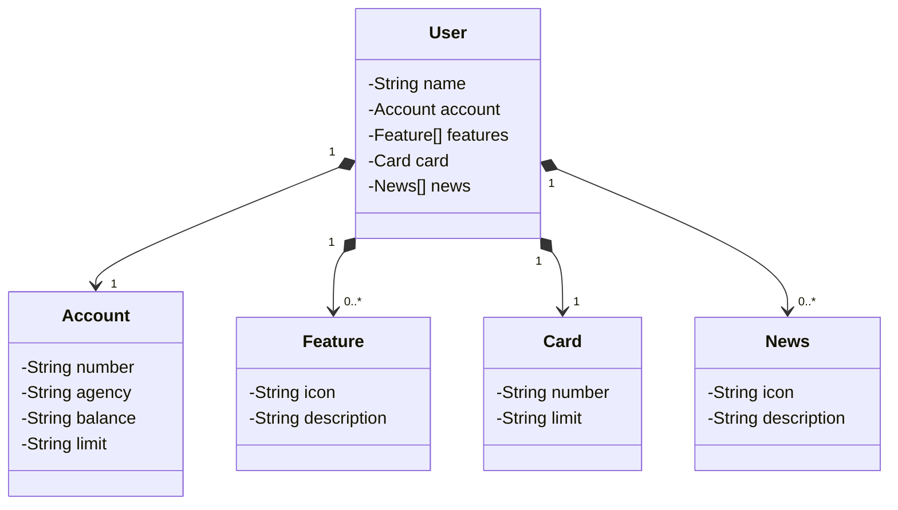

# RESTful API - Bank Project

# Sobre o projeto

Projeto para criar o backend da tela inicial do aplicativo Santander utilizando java, banco de dados(h2 e PostgreSQL) e o framework Spring. 

## Objetivos
- Entender o modelo conceitual
- Criar diagrama de classes de acordo com o modelo conceitual
- Implementar o diagrama de classes
- Dividir em camadas: Controller, Service e Repository que são respectivamente: Requisições http, regras de negócio e banco de dados.
- Atribuir as associações entre classes
- Utilizar Spring JPA para realizar as interações com o banco de dados
- Utilizar banco de dados H2 para o ambiente de desenvolvimento
- Utilizar PostgreSQL para o ambiente de produção
- Realizar o deploy da aplicação no Railway

## Modelo conceitual

## Diagrama de classes

# Tecnologias utilizadas
## Back end
- Java
- Spring Boot
- Spring JPA
- Banco de dados H2(em ambiente de desenvolvimento)
- Swagger
     

## Implantação em produção
- PostgreSQL(em ambiente de produção)

## Deploy na nuvem
- Railway

# Autor

Luccas Gonçalves Irineu

https://www.linkedin.com/in/luccas-goncalves/

