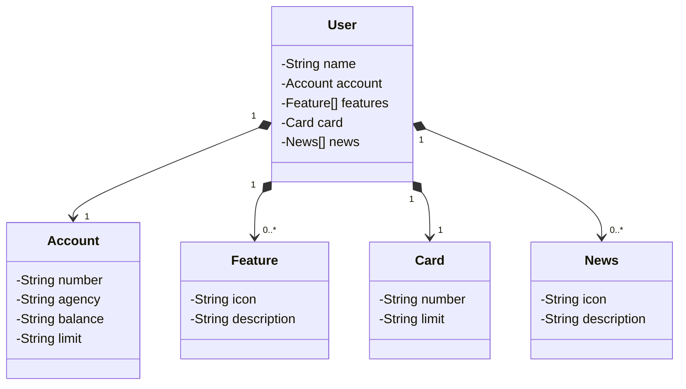

# RESTful API - Bank Project

# Sobre o projeto

WORK IN PROGRESS...

## Objetivos
WORK IN PROGRESS...

## Modelo conceitual

## Diagrama de classes

# Tecnologias utilizadas
## Back end
WORK IN PROGRESS...

## Implantação em produção
WORK IN PROGRESS...

# Autor

Luccas Gonçalves Irineu

https://www.linkedin.com/in/luccas-goncalves/

